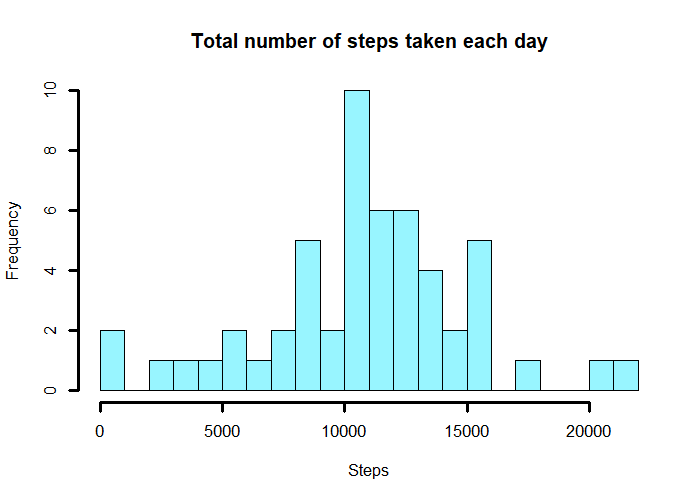
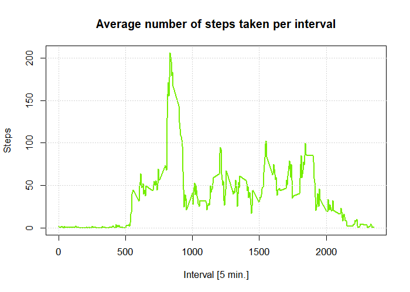
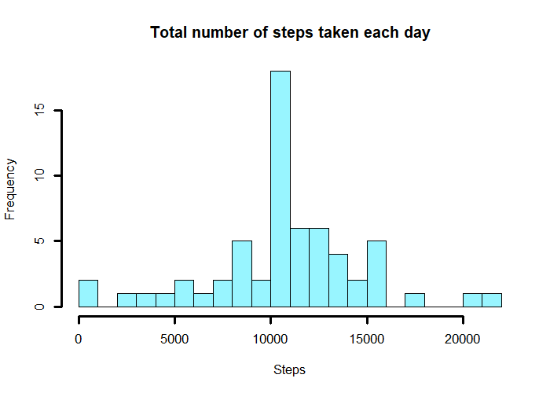

### Loading and preprocessing the data

```r
## Set data options
rawData_zip = "activity.zip"

## Unzip raw data and load it 
rawData = read.csv(file=unzip(rawData_zip, junkpaths=T),
                   header=T,
                   sep=",",
                   stringsAsFactors=FALSE,
                   colClasses=c("integer","Date","integer"))

## Print summary of raw data
summary(rawData)
```

```
##      steps             date               interval     
##  Min.   :  0.00   Min.   :2012-10-01   Min.   :   0.0  
##  1st Qu.:  0.00   1st Qu.:2012-10-16   1st Qu.: 588.8  
##  Median :  0.00   Median :2012-10-31   Median :1177.5  
##  Mean   : 37.38   Mean   :2012-10-31   Mean   :1177.5  
##  3rd Qu.: 12.00   3rd Qu.:2012-11-15   3rd Qu.:1766.2  
##  Max.   :806.00   Max.   :2012-11-30   Max.   :2355.0  
##  NA's   :2304
```


### What is mean total number of steps taken per day?
> Missing values in dataset was ignored.

1. Calculate the total number of steps taken per day  

```r
## Calculate steps by date
stepsByDay = aggregate(steps ~ date, rawData, sum, na.rm=T)
```

2. Make a histogram of the total number of steps taken each day


```r
## Histogram of the total number of steps taken each day
hist(stepsByDay$steps,
     breaks = 20,
     main = "Total number of steps taken each day",
     xlab = "Steps",
     col = 'cadetblue1',
     lwd = 3
     )
```

<!-- -->

3. Calculate and report the mean and median of the total number of steps taken per day

- Mean  

```r
## Calculate mean
mean(stepsByDay$steps)
```

```
## [1] 10766.19
```

- Median

```r
## Calculate median
median(stepsByDay$steps)
```

```
## [1] 10765
```


### What is the average daily activity pattern?
> Missing values in dataset was ignored.

1. Make a time series plot (i.e. type = "l") of the 5-minute interval (x-axis) and the average number of steps taken, averaged across all days (y-axis)

```r
## Average steps per interval
stepsByInterval = aggregate(steps ~ interval, rawData, mean, na.rm=T)

## Make plot
with(stepsByInterval,
    plot(interval,
        steps,
        main = "Average number of steps taken per interval",
        xlab = "Interval [5 min.]",
        ylab = "Steps",
        col = "chartreuse2",
        lwd = 2,
        type="l"
    )
)
grid()
```

<!-- -->

2. Which 5-minute interval, on average across all the days in the dataset, contains the maximum number of steps?

```r
## Interval
stepsByInterval$interval[which.max(stepsByInterval$steps)]
```

```
## [1] 835
```

### Imputing missing values

1. Calculate and report the total number of missing values in the dataset.

```r
## Number of missing values
sum(is.na(rawData$steps))
```

```
## [1] 2304
```

2. Devise a strategy for filling in all of the missing values in the dataset  

> I will use the means for the 5-minute intervals as fillers for missing
values.

3. Create a new dataset that is equal to the original dataset but with the missing data filled in.

```r
## Merging datasets and replace NA-values with mean value of interval
syntheticData = merge(rawData, stepsByInterval, by.x = "interval", by.y = "interval")
syntheticData$mergedSteps = syntheticData$steps.x
naCols = is.na(syntheticData$steps.x)
syntheticData$mergedSteps[naCols] = syntheticData$steps.y[naCols]

## Delete temporary columns and rename new set column names
syntheticData=syntheticData[,c(5,3,1)]
names(syntheticData) = names(rawData)

## Summarize steps by date
stepsByDaySyntheticData = aggregate(steps ~ date, syntheticData, sum)
```
4. Make a histogram of the total number of steps taken each day. Calculate and report the mean and median total number of steps taken per day

```r
## Histogram of the total number of steps taken each day without NAs
hist(
    stepsByDaySyntheticData$steps,
    breaks = 20,
    main = "Total number of steps taken each day",
    xlab = "Steps",
    col = 'cadetblue1',
    lwd = 3
    )
```

<!-- -->

- Mean

```r
## Calculate mean
mean(stepsByDaySyntheticData$steps)
```

```
## [1] 10766.19
```

- Median

```r
## Calculate median
median(stepsByDaySyntheticData$steps)
```

```
## [1] 10766.19
```

> The impact of the missing data seems rather low, at least when estimating the total number of steps per day.
 
### Are there differences in activity patterns between weekdays and weekends?

1. Create a new factor variable in the dataset with two levels – “weekday” and “weekend” indicating whether a given date is a weekday or weekend day.

```r
## Subset weekends and factorize
weekend = weekdays(syntheticData$date) %in% c("sábado","domingo")
weekend = lapply(weekend, function(x){ if(x == T) { "weekend" } else { "weekday" }})

## New factor variable with 2 levels: "weekend" & "weekday"
syntheticData$dayofweek = as.factor(as.character(weekend))

## Subset new plot data
stepsByIntervalSyntheticData = aggregate(steps ~ interval + dayofweek, data = syntheticData, mean)
```

2. Make a panel plot containing a time series plot (i.e. type = "l") of the 5-minute interval (x-axis) and the average number of steps taken, averaged across all weekday days or weekend days (y-axis).

```r
### plotting with different colors
par(mfrow = c(2,1), mar = c(0, 2, 0, 1), oma = c(2, 2, 2, 2))
with(
    ### plotting data
    stepsByIntervalSyntheticData, 
    {
        
    ## Plot weekend stats with legend, grid and axis on right side
    plot(steps[dayofweek == "weekend"] ~ interval[dayofweek == "weekend"], type="l", 
         lwd=2, ylab="", xlab="", col="mediumslateblue", xaxt='n', yaxt="n")
    legend("topright",
           c("weekend", "weekday"), 
           col=c("mediumslateblue","firebrick3"),
           bty="n",
           lwd=2)
    axis(side=4)
    grid()
    
    ## Plot weekday stats with grid
    plot( steps[dayofweek == "weekday"] ~ interval[dayofweek == "weekday"], type="l", 
          lwd=2, xlab="Interval (5 Min)", ylab="", col="firebrick3")
    grid()
    
    ## Plot figure labels
    mtext("Average steps per interval", outer= T)
    par(oma=c(10,3,1,1))
    mtext("Steps", side=2, outer=T)
    par(oma=c(1,30,1,1))
    mtext("Interval", side=1, outer=T)
    }
)
```

<!-- -->
